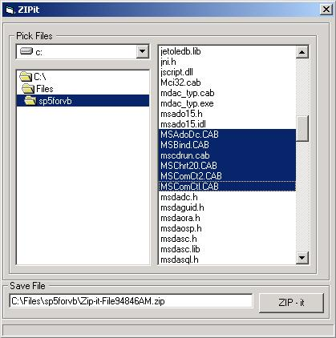



## ZIP\-it : COM\-\>less ZIP Compression

### Description

Zip-it is an example program that uses JAVA Class to compress multiple files into

ZIP file. Zip file created is compatible with ZIP format and can be opened by WINZIP , WINRar etc. Program does not shell out in order to compress the files instead Java Class object reference is created inside VB program. Only compress function is supported right now.. but if there is demand for it I can write de-compress code as well. Enjoy!

>>Please Comment and/or Vote.. Thanks<<
 
### More Info
 

             |
---                |---
**Submitted On**   |2003-02-05 10:07:12
**By**             |[OldManMarcin](https://github.com/Planet-Source-Code/PSCIndex/blob/master/ByAuthor/oldmanmarcin.md)
**Level**          |Advanced
**User Rating**    |4.6 (41 globes from 9 users)
**Compatibility**  |VB 6\.0
**Category**       |[Files/ File Controls/ Input/ Output](https://github.com/Planet-Source-Code/PSCIndex/blob/master/ByCategory/files-file-controls-input-output__1-3.md)
**World**          |[Visual Basic](https://github.com/Planet-Source-Code/PSCIndex/blob/master/ByWorld/visual-basic.md)
**Archive File**   |[ZIP\-it\_\_\_C153991252003\.zip](https://github.com/Planet-Source-Code/oldmanmarcin-zip-it-com-less-zip-compression__1-42981/archive/master.zip)

